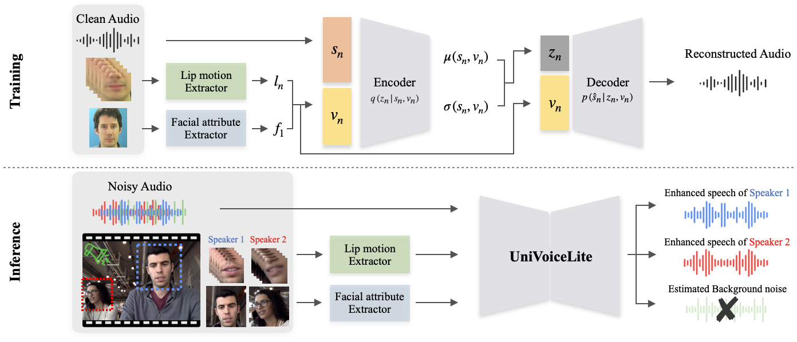

# [ASRU 2025] Lightweight Wasserstein Audio-Visual Model for Unified Speech Enhancement and Separation


> Official implementation of "Lightweight Wasserstein Audio-Visual Model for Unified Speech Enhancement and Separation (ASRU '25)" Jisoo Park\*, Seonghak Lee\*, Guisik Kim, Taewoo Kim, Junseok Kwon


<p align="center">
  
</p>

---

## Abstract
Speech Enhancement (SE) and Speech Separation (SS) have traditionally been treated as distinct tasks in speech processing. However, real-world audio often involves both background noise and overlapping speakers, motivating the need for a unified solution. While recent approaches have attempted to integrate SE and SS within multi-stage architectures, these approaches typically involve complex, parameter-heavy models and rely on supervised training, limiting scalability and generalization.  
In this work, we propose *UniVoiceLite*, a lightweight and unsupervised audio-visual framework that unifies SE and SS within a single model. UniVoiceLite leverages lip motion and facial identity cues to guide speech extraction and employs Wasserstein distance regularization to stabilize the latent space without requiring paired noisy-clean data. Experimental results demonstrate that UniVoiceLite achieves strong performance in both noisy and multi-speaker scenarios, combining efficiency with robust generalization.

---

## Features
- Unified model for speech enhancement and speech separation
- Lightweight architecture (parameter-efficient)
- Wasserstein latent space regularization
- Audio-visual fusion with both lip features and facial attributes

---

## Installation
```bash
git clone https://github.com/jisoo-o/UniVoiceLite.git
cd UniVoiceLite
pip install -r requirements.txt
```

##  Dataset Preparation
We use the **GRID** dataset (audio + video).  
The GRID Corpus dataset can be downloaded at:  
https://spandh.dcs.shef.ac.uk/gridcorpus/  
or using the provided script:
```bash
sh gridcorpus.sh
```

Before training, preprocess the dataset to extract:
- **Lip ROI sequences** (`.npy`)
- **Facial attribute features** (`.pt`)

Run:
```bash
python preprocess.py --base_dir /path/to/GRID_dataset \
    --shape_predictor ./shape_predictor_68_face_landmarks.dat
```


---

## Training
```bash
python train.py \
    --save_dir ./experiments/exp1 \
    --mode train \
    --batch_size 512 \
    --lr 1e-4 \
    --beta 0.9 \
    --pgrad 0.2
```

---
## Acknowledgements
This repo builds upon ideas and code from: 
[audio-visual speech enhancement (AVSE)](https://github.com/msaadeghii/avse-vae)

---
## Citation
If you find this work useful, please cite our paper:

```bibtex
@inproceedings{park2025lightweight
  title     = {Lightweight Wasserstein Audio-Visual Model for Unified Speech Enhancement and Separation},
  author    = {Park, Jisoo and Lee, Seonghak Lee and Kim, Guisik and Kim, Taewoo and Kwon, Junseok},
  booktitle = {Proc. IEEE ASRU},
  year      = {2025}
}
